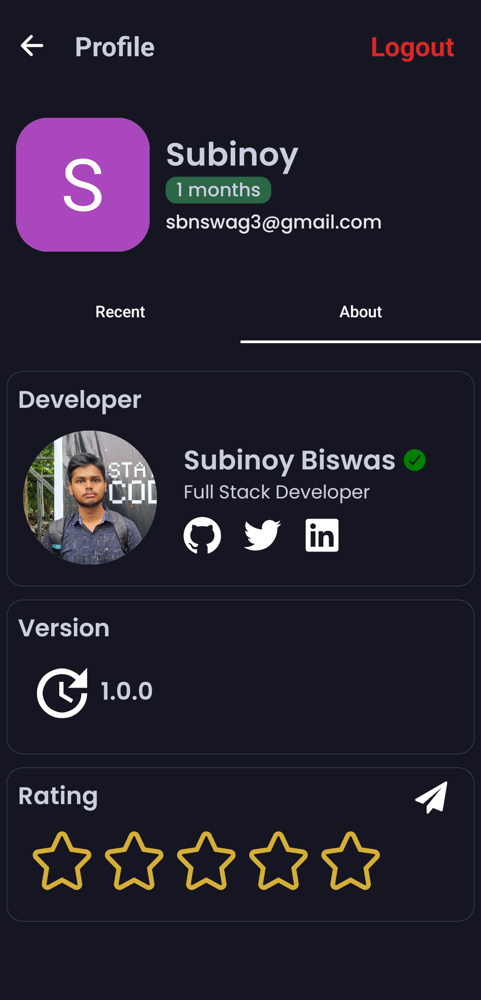

# Notifyy

Notifyy is a fun and constructive notification app built with React Native Expo. It sends out random, cute, and uplifting notifications to brighten your day. With a user-friendly interface, Notifyy also offers engaging content such as fun facts, music, and featured articles, making it more than just a notification app.

## Features

- **Random Notifications**: Receive cute, fun, and constructive messages at random times to keep your spirits up.
- **Facts, Music, and Articles**: Explore a variety of interesting facts, listen to music, and read featured articles right from the app.
- **User-Friendly Interface**: Simple, intuitive design that enhances the overall user experience.

## Usage

- Open Notifyy and let it run in the background to start receiving random notifications.
- Navigate through the app's UI to explore fun facts, listen to music, and read featured articles.
- Customize your notification settings to adjust the type and frequency of notifications.

## Technologies Used

- **React Native**: For building the mobile app interface.
- **Expo**: For easy development, testing, and deployment of the app.
- **Content Integration**: Displays facts, music, and articles within the app interface.

## Contributing

Contributions are welcome! If you'd like to add new features, improve existing ones, or fix bugs, please fork the repository and submit a pull request.

1. Fork the project
2. Create your feature branch (`git checkout -b feature/NewFeature`)
3. Commit your changes (`git commit -m 'Add New Feature'`)
4. Push to the branch (`git push origin feature/NewFeature`)
5. Open a pull request

## License

This project is licensed under the MIT License - see the [LICENSE](LICENSE) file for details.

## Contact

For questions or feedback, feel free to reach out at:

- **Author**: Subinoy Biswas
- **GitHub**: [subinoybiswas](https://github.com/subinoybiswas)

